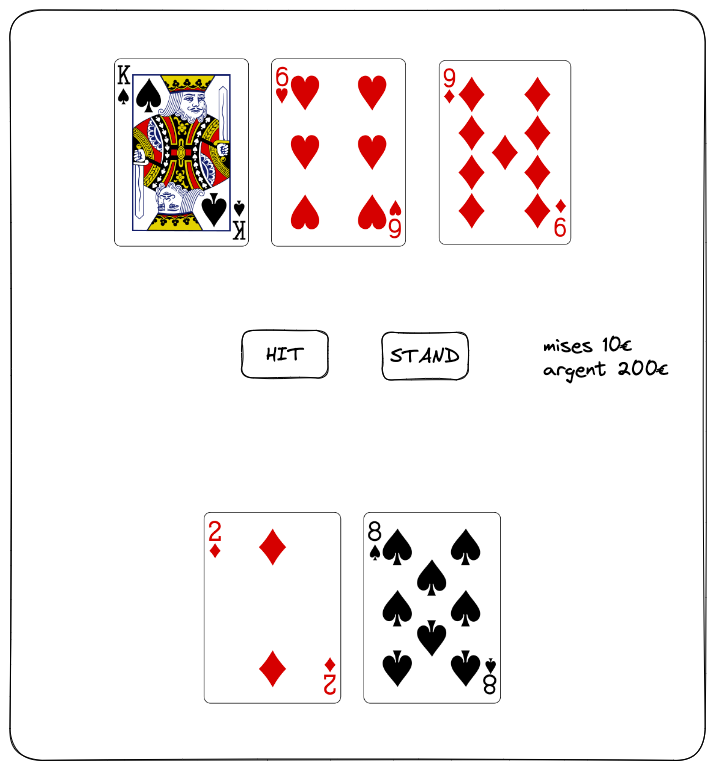
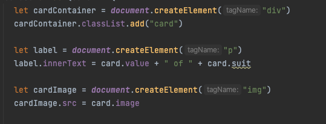

# Web-Jack

Intro to Javascript networking and working with an API.

We'll be making a blackjack game with https://www.deckofcardsapi.com/

## 1. Let's start with the layout.

You'll start by building a page to host hour game.



You can use images of cards with the following logic to get the url :
**https://deckofcardsapi.com/static/img/KS.png** (King of Spades)
**https://deckofcardsapi.com/static/img/5C.png** (5 of Club)

## 2. Let's make actions out those buttons.

Make your buttons do something. You can add event listeners to click of buttons to add logs.

## 3. Let's work with the API.

1. Have a look at the documentation of the API : https://deckofcardsapi.com/
2. Download the following plugin to make your life easier : https://marketplace.visualstudio.com/items?itemName=humao.rest-client
3. Create a file called **api.http** and add the following code :

```http
GET https://www.deckofcardsapi.com/api/deck/new/shuffle/?deck_count=1
Accept: application/json
```

You can then run the code by clicking on the **Send Request** button to see the result of the api call.

* Try other crafting other calls from the documentation.
* What happens if you change the url with other parameters ?
* What happens if you change the method to POST ?
* What happens if you change the url to a not existing url ?
* What happens if you change the url to a webpage like google.com ?

## 4. Let's make an API call from within your webpage.

In order to make an API call from within your webpage, you'll need to use the **fetch** function.

If you replace your console.log with the following code :

```javascript
fetch('https://www.deckofcardsapi.com/api/deck/new/shuffle/?deck_count=1')
```

* what happens ?
* what does `fetch` returns ?

**TO BE DISCUSSED** in class.

5. Let's use the API to draw cards.

Change/add to your fetch call in order to use the api and add the cards to your page.

6. Let's structure a little bit our code

Add the following class to your script :
```javascript
class Deck {
  constructor() {
    this.deck_id = null
    this.cards = []
  }

  fetchCards() {
    return fetch('https://deckofcardsapi.com/api/deck/new/draw/?count=52')
          .then(res => res.json())
          .then(json => {
            this.cards = json.cards
            this.deck_id = json.deck_id
          })
  }

  logCards() {
    console.log(this.cards)
  }
}
```

* How to use this class from within your listener ?

7. Let's extract our class in a dedicated module

Copy the class in a file called `deck.js`

* How to loaded in your webpage ?
* How to import the class in the script page

**Discuss modules in class**

8. Let's make it a working game !

# Web-Jack 2.0

## Why this solution is inefficient ?

### Declarative vs Imperative

> Imperative programming: telling the "machine" how to do something, and as a result what you want to happen will happen. 
> Declarative programming: telling the "machine"1 what you would like to happen, and let the computer figure out how to do it.

(source http://latentflip.com/imperative-vs-declarative)

### State is hard to manage

Imagine you'd have to hundle a button start a new game that would appear before the game. On the click of the button,
you'd change it to the current layout. You'd have to keep track of the state of the game, and the state of the button and handle
multiple **addEventListener** and remove them properly.

### *createElement* is not readeable



erk...

How about :

```jsx
let cardContainer = <div className="card">
  <p>{card.value} of {card.suit}</p>
  
</div>
```

much easier to read, right ?

### How to use external libraries ?

We only used the **fetch** function from the browser. 
What if we want to use a library like **moment** (to manipulate dates) or **lodash** (to manipulate everything else) ?

Especially when dealing with front -> you might want to use specific libraries for beautiful components, animations, etc.
### Performances

Performance is a **big** deal in web development.

With the current solution, their is no way to optimize what is rendered on the page.

Exemple of the optimization we would like to *plug* in our code :

* Minify JS / Minify CSS
* Bundle optimization -> bundle all your JS in one file and/or not render unused code.
* Lazy loading -> only load the code you need when you need it.
* Caching -> cache the code you already loaded so you don't have to load it again.
* Virtual DOM -> only render the part of the page that changed.
* Image pre-processing
* etc.

### How to statistically test/improve your code ?

* Typescript
* jsdoc
* jslint
* tests integration/unit
* sass / less

## How to solve this ?

### What is our level in frontend dev ?

Let's have a look at :
https://roadmap.sh/frontend

### What about now ?

Let's have a look at 'npm' / 'vite' / 'solidjs'

From a new folder

```bash
npx degit solidjs/templates/js mines-jack-improved
```

We can launch a dev server :

```bash
npm run dev
```

* Let's copy our html in `src/App.js` (find the right place to put it)
* Remove `App.module.css` and replace it with a `src/App.css` coming from your previous project.
* (optional) Let's add a `src/deck.js` file with the class we created before.

### Let's refactor with components

```jsx
let Button = ({ text, onClick }) => {
  return <button class="btn" onClick={onClick}>{text}</button>
}
```

To use it, add in the render from App.js :

```jsx
// ...
<Button text="Draw" onClick={() => console.log("It works like magic")} />
<Button text="Hit" onClick={() => console.log("It works like magic")} />
// ...
```

Let's reflect in class

### Let's work with state value


```jsx
import { createSignal } from 'solid-js'; 
// ...

function App() {
  const [gameStarted, setGameStarted] = createSignal(false);
  // ...
}
```

Change the button to the following :

```jsx
        {gameStarted() &&
          <>
            <Button text="Hit" onClick={() => console.log("HIT")}/>
            <Button text="Draw" onClick={() => console.log("DRAW")}/>
          </>
        }
        {!gameStarted() &&
          <Button text="Start Game" onClick={() => setGameStarted(true)} />
        }
```

### How to fetch datas ?

```jsx
import { createResource } from 'solid-js';
// ...
let fetchCards = async () => {
  let response = await fetch('https://deckofcardsapi.com/api/deck/new/draw/?count=2');
  let data = await response.json();
  return data.cards;
}
// ...
let [cardsPlayer] = createResource(gameStarted, fetchCards, { initialValue: [] })
// ...
return //...
   <For each={cardsPlayer()}>
      {card => <div class="image">
        <p>{ card.value } of { card.suit }</p>
        
      </div>
      }
  </For>
```


Formulaire sur le cours -> https://forms.gle/SrwDUZdQPDooXfEw7
